# gRPCurl Test Results

---

## 📚 BookService Tests

### ✅ ListBooks

**Command:**

```bash
grpcurl -plaintext -proto university.proto 127.0.0.1:50051 university.BookService/ListBooks
```

**Response:**

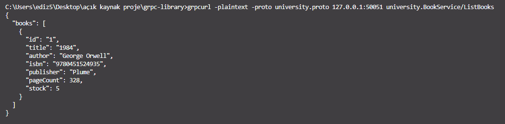

---

### ✅ CreateBook

**Command:**

```bash
grpcurl -plaintext -proto university.proto -d "{ \"id\": \"2\", \"title\": \"Brave New World\", \"author\": \"Aldous Huxley\", \"isbn\": \"9780060850524\", \"publisher\": \"Harper Perennial\", \"pageCount\": 288, \"stock\": 7 }" 127.0.0.1:50051 university.BookService/CreateBook
```

**Response:**

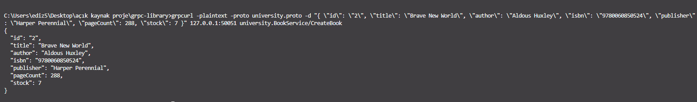

---

### ✅ UpdateBook

**Command:**

```bash
grpcurl -plaintext -proto university.proto -d "{ \"id\": \"2\", \"title\": \"Brave New World - Updated\", \"author\": \"Aldous Huxley\", \"isbn\": \"9780060850524\", \"publisher\": \"Harper Perennial\", \"pageCount\": 300, \"stock\": 10 }" 127.0.0.1:50051 university.BookService/UpdateBook
```

**Response:**

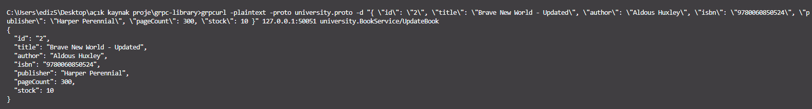

---

### ✅ GetBook

**Command:**

```bash
grpcurl -plaintext -proto university.proto -d "{ \"id\": \"2\" }" 127.0.0.1:50051 university.BookService/GetBook
```

**Response:**

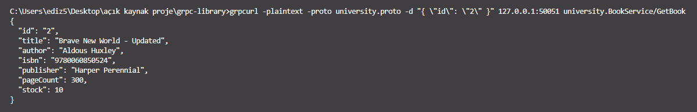

---

### ✅ DeleteBook

**Command:**

```bash
grpcurl -plaintext -proto university.proto -d "{ \"id\": \"2\" }" 127.0.0.1:50051 university.BookService/DeleteBook
```

**Response:**

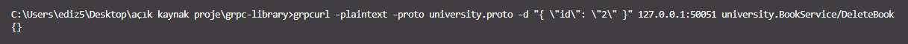

---

### ✅ ListBooks (Post-Deletion)

**Command:**

```bash
grpcurl -plaintext -proto university.proto 127.0.0.1:50051 university.BookService/ListBooks
```

**Response:**

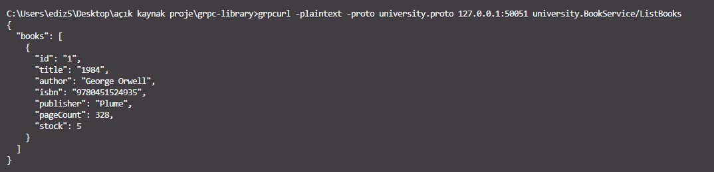

---

## 👤 StudentService Tests

### ✅ CreateStudent

```bash
grpcurl -plaintext -proto university.proto -d "{ \"id\": \"stu1\", \"name\": \"Alice Smith\", \"studentNumber\": \"2023001\", \"email\": \"alice@example.com\", \"isActive\": true }" 127.0.0.1:50051 university.StudentService/CreateStudent
```

**Response:**

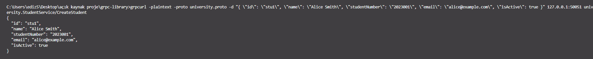

---

### ✅ ListStudents

```bash
grpcurl -plaintext -proto university.proto 127.0.0.1:50051 university.StudentService/ListStudents
```

**Response:**

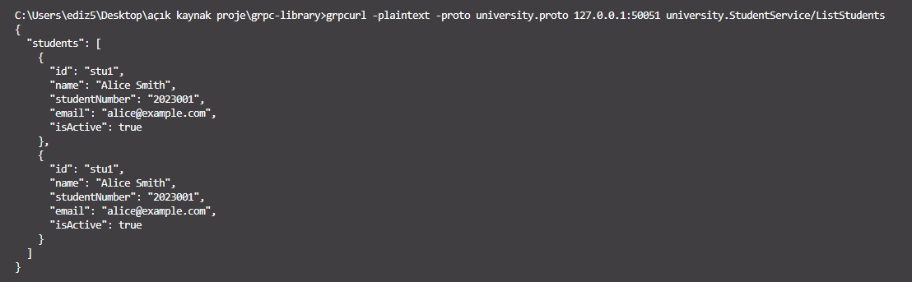

---

### ✅ GetStudent

```bash
grpcurl -plaintext -proto university.proto -d "{ \"id\": \"stu1\" }" 127.0.0.1:50051 university.StudentService/GetStudent
```

**Response:**

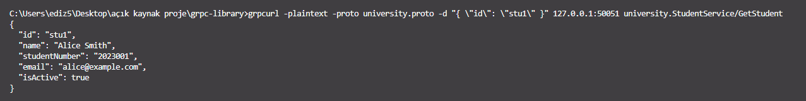

---

### ✅ UpdateStudent

```bash
grpcurl -plaintext -proto university.proto -d "{ \"id\": \"stu1\", \"name\": \"Alice Johnson\", \"studentNumber\": \"2023001\", \"email\": \"alice.johnson@example.com\", \"isActive\": false }" 127.0.0.1:50051 university.StudentService/UpdateStudent
```

**Response:**

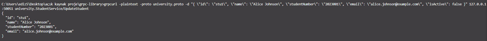

---

### ✅ DeleteStudent

```bash
grpcurl -plaintext -proto university.proto -d "{ \"id\": \"stu1\" }" 127.0.0.1:50051 university.StudentService/DeleteStudent
```

**Response:**

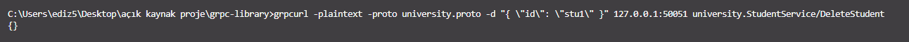

---

### ✅ ListStudents (Post-Deletion)

```bash
grpcurl -plaintext -proto university.proto 127.0.0.1:50051 university.StudentService/ListStudents
```

**Response:**

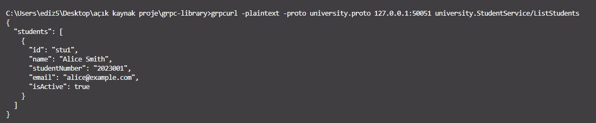

---

## 🔄 LoanService Tests

### ✅ BorrowBook

**Command:**

```bash
grpcurl -plaintext -proto university.proto -d "{ \"id\": \"loan10\", \"studentId\": \"stu100\", \"bookId\": \"book100\", \"loanDate\": \"2025-06-15\", \"status\": \"ONGOING\" }" 127.0.0.1:50051 university.LoanService/BorrowBook
```

**Response:**

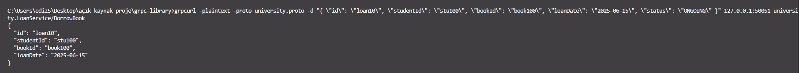

---

### ✅ ListLoans

**Command:**

```bash
grpcurl -plaintext -proto university.proto 127.0.0.1:50051 university.LoanService/ListLoans
```

**Response (after borrow):**

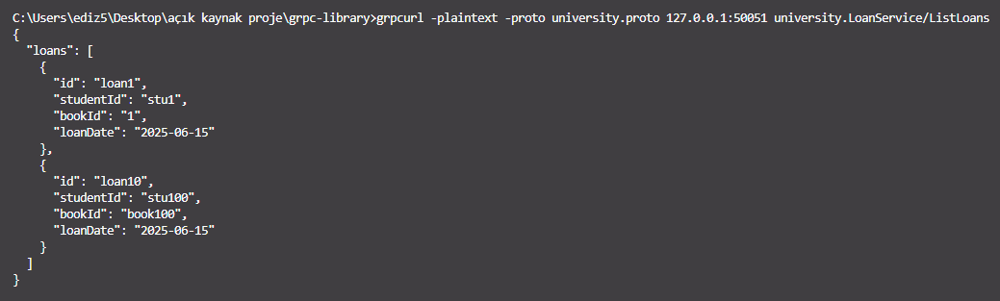

---

### ✅ GetLoan

**Command:**

```bash
grpcurl -plaintext -proto university.proto -d "{ \"id\": \"loan10\" }" 127.0.0.1:50051 university.LoanService/GetLoan
```

**Response:**

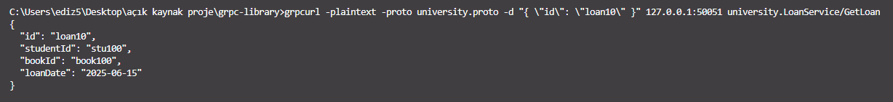

---

### ✅ ReturnBook

**Command:**

```bash
grpcurl -plaintext -proto university.proto -d "{ \"id\": \"loan10\" }" 127.0.0.1:50051 university.LoanService/ReturnBook
```

**Response:**

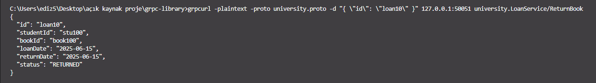

---

### ✅ DeleteLoan

**Command:**

```bash
grpcurl -plaintext -proto university.proto -d "{ \"id\": \"loan10\" }" 127.0.0.1:50051 university.LoanService/DeleteLoan
```

**Response:**

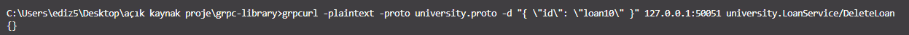

---

### ✅ ListLoans (Post-Deletion)

**Command:**

```bash
grpcurl -plaintext -proto university.proto 127.0.0.1:50051 university.LoanService/ListLoans
```

**Response:**

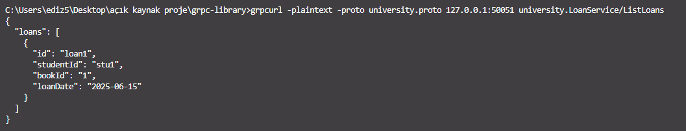
